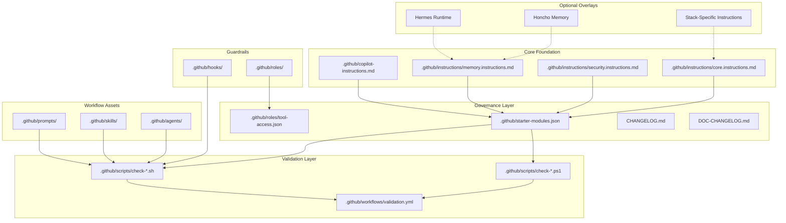
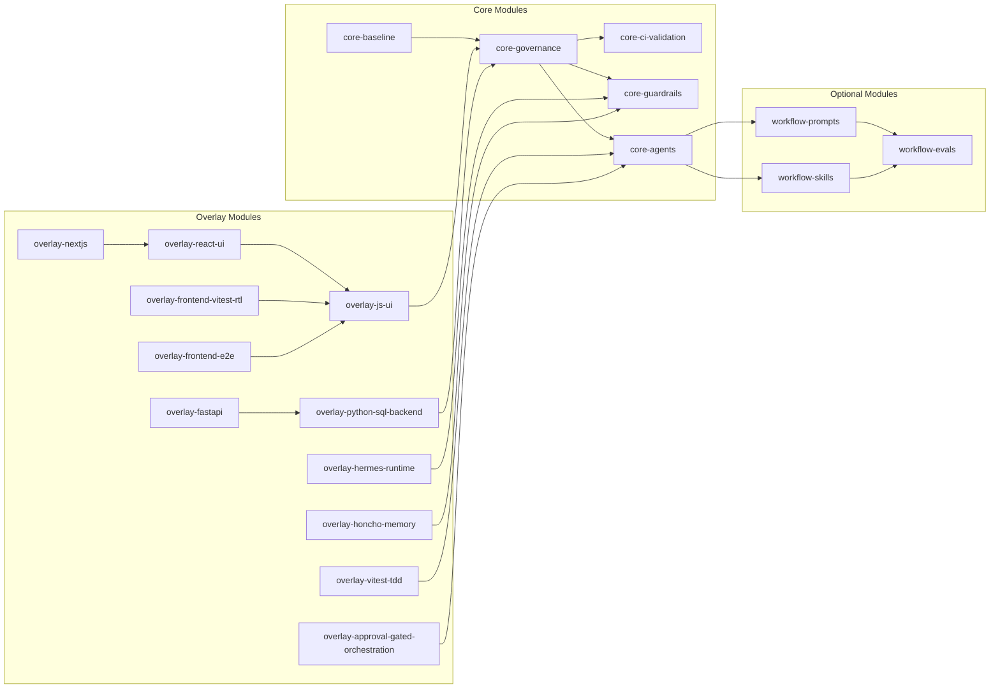
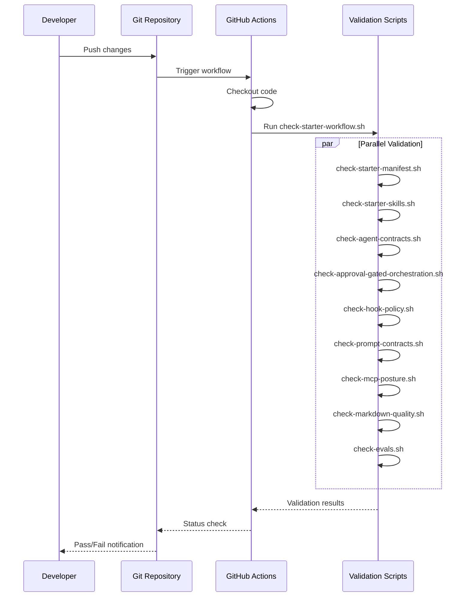
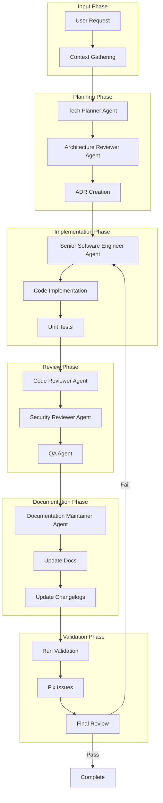
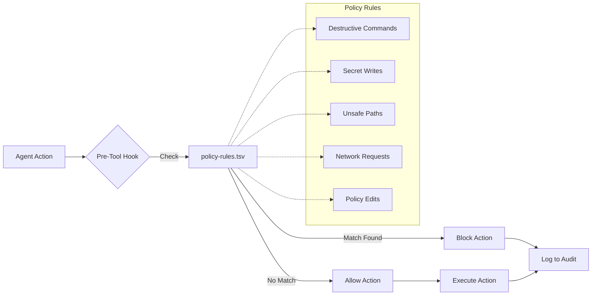
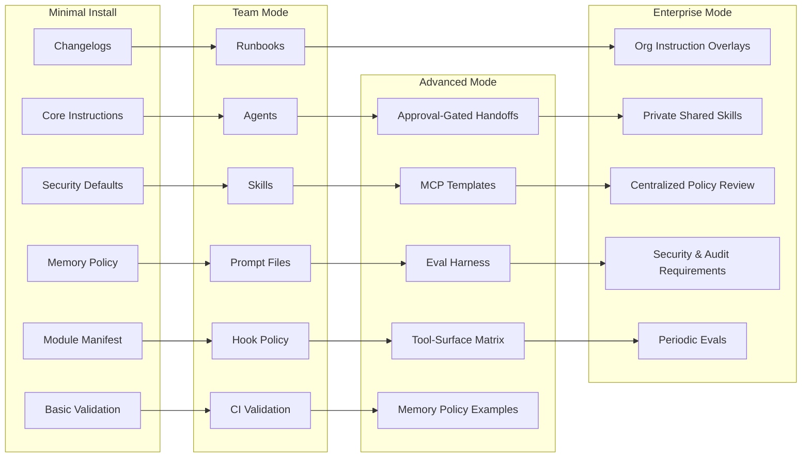
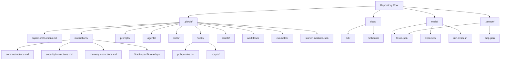
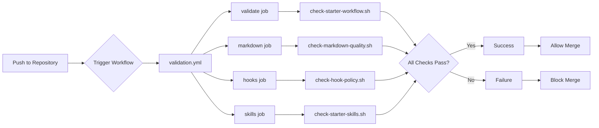
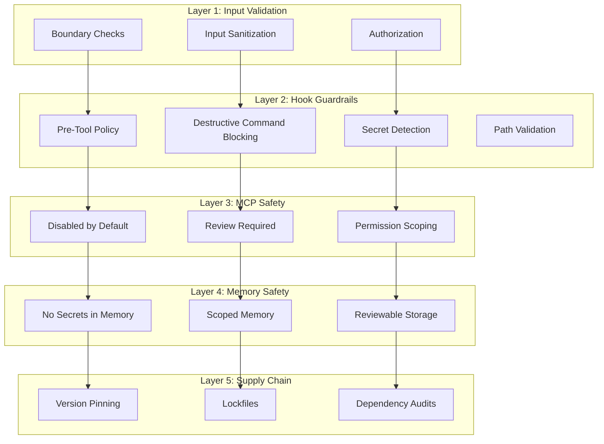

# Architecture Diagrams

This document provides visual representations of the Agentic Development Starter's structure, module relationships, and workflows.

## High-Level Architecture



## Module Dependency Graph



## Validation Workflow



## Agent Workflow Pattern



## Memory Layer Architecture

```mermaid
graph TB
    subgraph "Layer 1: Session Memory"
        A[Current Task State]
        B[Active Context]
        C[Temporary Notes]
    end
    
    subgraph "Layer 2: Repo Truth"
        D[Instructions]
        E[Decisions]
        F[Standards]
        G[Contracts]
        H[Runbooks]
        I[Changelogs]
    end
    
    subgraph "Layer 3: Durable Memory (Optional)"
        J[User Preferences]
        K[Team Patterns]
        L[Repeated Workflows]
    end
    
    subgraph "Memory Providers"
        M[Hermes Runtime]
        N[Honcho]
    end
    
    A --> D
    B --> E
    C --> F
    D --> J
    E --> K
    F --> L
    M -.-> Layer 3
    N -.-> Layer 3
    
    style Layer 1 fill:#e1f5ff
    style Layer 2 fill:#fff4e1
    style Layer 3 fill:#e8f5e9
```

## Hook Policy Flow



## Module Adoption Progression



## File Organization Structure



## CI/CD Pipeline



## Security Layers



## Usage Examples

### Viewing Diagrams

These diagrams use Mermaid syntax. To view them:

1. **In VS Code**: Install the "Markdown Preview Mermaid Support" extension
2. **On GitHub**: Mermaid diagrams render automatically in Markdown files
3. **Online**: Use [Mermaid Live Editor](https://mermaid.live/)

### Customizing Diagrams

You can customize these diagrams by:
- Editing the Mermaid syntax directly
- Using the Mermaid Live Editor to experiment
- Adding new diagrams for your specific use cases

### Adding New Diagrams

When adding new diagrams:
1. Follow the existing Mermaid syntax
2. Keep diagrams focused and readable
3. Update this document's table of contents
4. Test rendering in your target platform
