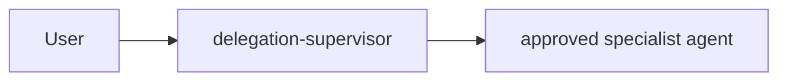

# Supervisor Orchestration Runbook

This runbook describes the optional supervisor orchestration overlay for teams that want a supervisor to delegate bounded tasks to approved specialist agents while keeping guided handoffs as the core default.

## Purpose

This overlay exists for repos that need supervised machine delegation with explicit boundaries, without turning the core starter into an autonomous workflow engine.

Core behavior does not change when the overlay is disabled:

- One main chat remains the orchestrator.
- Guided handoffs remain the baseline.
- Hidden automatic multi-agent chains remain excluded from core.
- Existing agents and approval-gated workflows continue to work unchanged.

The overlay only adds supervised delegation for repos that explicitly opt in.

## Module Files

- `.github/agents/delegation-supervisor.agent.md`
- `.github/skills/supervisor-orchestration/SKILL.md`
- `.github/roles/orchestration-policy.json`
- `.github/schema/delegation-plan.schema.json`
- `.github/examples/supervisor-orchestration/complex-feature-delegation-plan.json`
- `.github/scripts/check-supervisor-orchestration.ps1`
- `.github/scripts/check-supervisor-orchestration.sh`
- `docs/runbooks/supervisor-orchestration.md`
- `docs/adr/0003-supervisor-orchestration-overlay.md`

Add the overlay through `.github/starter-modules.json` and keep it default-disabled unless the target repo has a real need for it.

## Two Orchestration Roles, Two Jobs

The starter deliberately carries two orchestration roles. They are not interchangeable.

| Role | File | Job |
| --- | --- | --- |
| `orchestration-coordinator` | `.github/agents/orchestration-coordinator.agent.md` | Human-guided workflow transitions and approval-gated handoffs. The coordinator drafts a transition, the human approves it, and the chain advances only with explicit approval. |
| `delegation-supervisor` | `.github/agents/delegation-supervisor.agent.md` | Machine delegation of bounded tasks to approved specialist agents in isolated contexts, with results reconciled back into one coherent outcome. |

Do not merge these agents. The coordinator governs transitions between humans and specialists; the supervisor governs bounded work handed to specialists by another agent.

`delegation-supervisor` is unrelated to `overlay-approval-gated-orchestration`: the supervisor does not depend on that overlay and retains its own minimum approval semantics.

## How To Enable

1. Add `overlay-supervisor-orchestration` to the enabled modules for the repo.
2. Confirm `.github/roles/orchestration-policy.json` is present; it is the canonical policy source.
3. Confirm `.github/roles/tool-access.json` contains the `delegation-supervisor` entry and the `orchestration` role.
4. Keep nested delegation disabled in repository-controlled configuration.
5. Run the starter workflow checks.
6. Satisfy the enablement preconditions below before relying on the overlay for real work. An unverified hook-inheritance result scopes delegation rather than blocking enablement; see What An Unverified Result Allows.

### Enablement Preconditions

Neither precondition is observable by a static check, so both are enablement obligations rather than merge blockers on the default-disabled assets. Both belong in the delegation-boundary security review that ADR 0003 requires. The first is capability-scoped: it decides which workers may be delegated to, not whether the overlay may be enabled.

1. **Hook inheritance for delegated work.** Confirm that tool invocations made by a delegated subagent are still subject to the repository's `preToolUse` hook policy in the target runtime, and record the evidence. `preToolUse` is the only mechanical guardrail in this starter, and `docs/runbooks/hooks.md` states plainly that hooks cannot protect runtimes that do not invoke the hook lifecycle. Workers in this allow-list hold `edit` and `execute`, so if delegation escapes the hook seam the delegation boundary has no mechanical control at all. If the runtime cannot provide this evidence, record the gap explicitly rather than enabling the overlay on an assumed control.
2. **Delegation-capability mapping.** Confirm how `delegate-agent` maps to the host runtime's delegation primitive, per the Supported Runtimes table below, and record whether the host provides one at all. Until this is tested in the target environment, treat platform delegation support as unverified.

### What An Unverified Result Allows

The hook-inheritance precondition withholds a capability, not the overlay. It decides which workers may be delegated to.

| Hook-inheritance evidence | Permitted delegation |
| --- | --- |
| Verified in the target runtime | The full `specialistAllowList`. |
| Unverified or unverifiable | The non-mutating tier only: agents whose declared capabilities are a subset of `read`, `search`, and `todo`. In the shipped allow-list that is `architecture-reviewer`, `code-reviewer`, and `security-reviewer`. |

`delegation-supervisor` declares no `edit` and no `execute`, so enabling the overlay does not by itself create the exposure `preToolUse` guards. The exposure comes from delegating to a worker that holds `edit` or `execute` while that guardrail is absent, so that is the delegation the precondition withholds. Restricting to the non-mutating tier keeps the complex workflow's parallel read-only analysis stage and refuses every delegation that could mutate state unguarded.

A team that cannot obtain the evidence and needs mutating delegation is taking an exception, not a default path: record the gap, serialize every write delegation, have a human review each delegation plan before execution, and obtain maintainer approval for the exception. Treat it as accepted residual risk with a named approver.

If the target runtime exposes no delegation primitive at all, the second precondition fails on its own terms and Fallback When Delegation Is Unavailable applies; no enablement decision arises.

The non-mutating tier is derived from each agent's `tools` frontmatter, which the overlay checks already cross-check against `agentCapabilityMatrix` in `.github/roles/tool-access.json`. The frontmatter scan is the authoritative side, so an agent whose matrix entry is absent cannot shrink the tier. That tolerance is pinned rather than assumed: a positive fixture removes one allow-listed non-mutating member's `agentCapabilityMatrix` entry and requires the validator to accept the result. It is a static definition plus an operating obligation, not an enforced restriction, and this runbook must not describe it as one.

Both paired validators do assert two properties of that definition: the derived tier is non-empty, and an allow-listed agent file with no `agentCapabilityMatrix` entry is accepted. The first keeps a later edit from silently reducing the capability-scoped rule to the total block it is documented not to be, and the second keeps the tolerated state from starting to be rejected without a check going red. Together they prove the tier exists and how it is derived, never that it was used, and they say nothing about whether hook inheritance actually holds in a target runtime.

## What Happens When Disabled

- No automatic delegation occurs.
- No recursive delegation occurs.
- Guided handoffs, existing agents, and approval-gated workflows behave exactly as before.
- Overlay-scoped entries that live in shared governance files, such as the `orchestration` role in `.github/roles/tool-access.json`, remain present but idle.

## Delegation Depth

v1 supports exactly one delegation level.



Nested delegation is not supported:

```text
User -> Supervisor -> Agent -> Agent   (not allowed)
```

Workers must return results to the supervisor rather than invoking other agents. Only the `orchestration` role holds the `delegate-agent` capability.

## Simple Versus Complex Routing

The supervisor classifies every task before delegating. The canonical criteria live in `.github/roles/orchestration-policy.json`; the summary below explains them.

A task is **complex** if any of the following is true:

1. It changes more than one architectural layer or independently owned subsystem.
2. It requires an architecture or public-contract decision.
3. It adds, removes, or materially changes a dependency, framework, runtime, build tool, or infrastructure component.
4. It requires a database or schema migration or a data transformation.
5. It changes authentication, authorization, secrets, permissions, identity, security controls, or trust boundaries.
6. It changes deployment, production infrastructure, networking, CI/CD, release behavior, or runtime configuration.
7. It modifies starter or core governance assets such as `AGENTS.md`, `tool-access.json`, agent policy, module composition, validators, or architecture contracts.
8. It contains multiple independent implementation workstreams.
9. Acceptance criteria are incomplete, conflicting, or require technical design.
10. It crosses a mandatory human-approval boundary.
11. A sufficiently bounded implementation scope or write set cannot be established.

If none apply, the task is **simple**. When uncertain, classify it as **complex**. Do not classify by file count, prompt size, or token count.

### Simple workflow

```text
delegation-supervisor -> implementer -> appropriate validation/review -> done
```

Do not invoke planning or review agents on a simple task merely to create more agent activity.

### Complex workflow

```text
delegation-supervisor
  -> parallel read-only analysis where appropriate
       analyst, tech-planner, security-reviewer when security-relevant
  -> consolidated plan
  -> human approval when required
  -> senior-software-engineer
  -> parallel independent verification
       code-reviewer, security-reviewer when relevant, qa
  -> one consolidated repair task if blocking findings exist
  -> re-run affected verification
  -> done when blockers are cleared
```

A reviewer must not approve work it implemented itself.

## Approval Boundaries

`.github/roles/orchestration-policy.json` is the single source of truth for approval-required categories. The categories are:

- `architecture-change`
- `core-governance-change`
- `dependency-change`
- `destructive-data-change`
- `identity-security-change`
- `production-or-deployment-change`
- `destructive-operation`
- `scope-expansion`

Other documents may explain these categories but must reference the canonical policy rather than maintaining a second authoritative copy.

Before crossing a high-risk boundary, the supervisor must:

1. classify the proposed action against `.github/roles/orchestration-policy.json`;
2. stop if a category matches;
3. explain what will change and why approval is required;
4. obtain explicit human approval;
5. record that approval in task or handoff state;
6. continue only after approval is recorded.

### Prompt-level contract, not enforcement

This gate is a governance expectation encoded as a behavioral contract. The repository has no trusted identity source, no validated enforcement point, and no hook seam for agent-to-agent delegation. Nothing technically prevents an operator from ignoring the gate, and no static validator can detect a bypassed approval. Documentation and agent output must not describe this gate as enforced authorization.

## Write-Set Discipline

Before invoking any write-capable agent, the supervisor declares the intended write set. A delegation record looks like:

```yaml
delegation:
  agent: senior-software-engineer
  objective: Add role-based authorization.
  write_set:
    - app/Policies/**
    - app/Models/User.php
    - routes/admin.php
    - tests/Feature/AdminAuthorizationTest.php
```

Rules:

- Two write-capable agents may run concurrently only when their declared write sets are clearly disjoint.
- If the write set is unknown, broad, wildcard-only, `TBD`, or otherwise not safely bounded, serialize the work.
- Read-only analysis and review may always run in parallel.

The write-set rule is a review discipline in v1, not a machine-enforced lock. Overlapping parallel writes depend on the supervisor declaring the set honestly and on review catching a bad declaration. `serializedReason` is likewise optional in v1: a serialized delegation is not required to state why it was serialized, which is consistent with the rule being a review discipline rather than a validated contract.

Two narrow facts are machine-checked rather than left to review: `delegation-plan.schema.json` requires any `capability: "write"` delegation to declare a non-empty `writeSet`, and the repo-local checks reject a declared entry that is literally one of the policy's `unboundedIndicators`. Whether a declared set is genuinely bounded remains a review judgment.

## Supported Runtimes

`delegate-agent` is a runtime-neutral capability name, not a literal tool name. The overlay maps it to whatever delegation primitive the host provides:

| Platform | Delegation mapping |
| --- | --- |
| VS Code agent mode | `agent` / `runSubagent` |
| Other runtimes | Their own subagent or worker delegation primitive, when one exists |

The allow-list is expressed with native agent allow-list functionality where the platform supports it. Treat platform delegation support as unverified until tested in the target environment.

Hook lifecycle support is part of this mapping rather than a separate concern. Delegated work runs in an isolated agent context, so before enabling the overlay confirm that a subagent's tool calls still reach `preToolUse`. If the runtime does not invoke the hook lifecycle for delegated agents, the hook policy stops being a guardrail for the delegation boundary, and that gap must be recorded rather than assumed away. See Enablement Preconditions above and `docs/runbooks/hooks.md`.

## Fallback When Delegation Is Unavailable

If the runtime cannot actually delegate subagents, the supervisor produces a guided delegation plan rather than silently pretending delegation occurred. Each plan entry states:

- target agent
- objective
- relevant context
- write set, where applicable
- acceptance criteria
- expected return format
- recommended execution order

The supervisor must not collapse specialist roles into one fake multi-agent execution.

## Validating The Overlay Assets

Use the repo-local checks to confirm the overlay stays consistent:

- PowerShell: `.github/scripts/check-supervisor-orchestration.ps1`
- Shell: `.github/scripts/check-supervisor-orchestration.sh`

For the broader starter checks, use:

- PowerShell: `.github/scripts/check-starter-workflow.ps1`
- Shell: `.github/scripts/check-starter-workflow.sh`

The checks verify deterministic repository facts: module registration, default-disabled state, required files, the capability and role model, the sole-holder rule, the allow-list, the non-mutating delegation tier's non-emptiness, the approval categories, the delegation depth, the write-set and enforcement flags, the declared write set's non-emptiness and boundedness, every agent file's frontmatter, the approval-gate wording in the agent catalog, every agent file, and the role, scope, and intent strings in `tool-access.json`, the `agentRoleHints` agreement with the capability matrix, and the delegation-plan example against `delegation-plan.schema.json`.

The sole-holder check is anchored on every `.github/agents/*.agent.md` file rather than on the capability matrix, because a new agent file can appear without a matrix entry and would otherwise escape a matrix-only check. It parses each agent's `tools` frontmatter, requires that exactly one agent file declares `delegate-agent`, and then requires `.github/roles/tool-access.json` to agree with it in both directions: every `agentCapabilityMatrix` entry must have a matching agent file, and each entry's declared capabilities must equal that agent's frontmatter set. It also rejects a `specialistAllowList` that lists a delegation-capable agent, an `agentCapabilityMatrix` entry that enables a tool absent from `toolDefinitions`, and an `agentRoleHints` entry that disagrees with the same agent's matrix role.

The `tools` obligation is scoped to the agents that carry one. `tools:` is optional in `.agent.md` frontmatter, so only a file registered in `agentCapabilityMatrix` must have a parseable `tools` list; a file that declares `delegate-agent` is caught by the frontmatter scan whether or not it is registered. An unregistered agent file with no `tools` list is therefore out of scope rather than an error, and a registered agent file that omits the list is reported with its own diagnostic instead of being reported as a missing file.

One boundary remains, and it is deliberate rather than an oversight. An agent file that carries no `delegate-agent` capability and has no `agentCapabilityMatrix` entry is not rejected; only the delegation capability must be registered. `orchestration-coordinator` is the current instance: its tool boundary matches no core role id, so registering it would be a role-model decision rather than a validation fix, and it is out of scope for this overlay.

Both checks also run a fixture suite. Each fixture copies the repository state and mutates one fact: a negative fixture requires the validator to reject the mutated state with a specific message, and a positive fixture requires it to accept the mutated state. Eighteen fixtures run per platform: seventeen negative and one positive, so the checks cannot silently degrade into no-ops. The negative fixtures cover the overlay being enabled by default, a second agent or role declaring `delegate-agent`, the supervisor frontmatter diverging from the `orchestration` role, a write delegation that omits its declared write set, a write delegation that declares an unbounded write set, the agent catalog drifting back to describing the approval gate as enforcement, an agent file drifting back to describing the approval gate as enforcement, a non-supervisor agent file gaining `delegate-agent` in its own frontmatter, an agent file declaring `delegate-agent` while escaping the capability matrix entirely, a `specialistAllowList` that admits a delegation-capable agent, an agent whose frontmatter diverges from its `agentCapabilityMatrix` entry, a capability-matrix entry with no agent file, a registered agent file that declares no `tools` list, a capability-matrix entry that enables a tool absent from `toolDefinitions`, an `agentRoleHints` entry that disagrees with the matrix role, and every allow-listed agent gaining a mutating capability so that the non-mutating tier empties, with the last derived member also losing its `agentCapabilityMatrix` entry before the mutation loop starts, so that the loop observes the entry-absent state at the last member's index — a non-zero index for any tier larger than one and index 0 for a single-member tier — and a dropped removal is reported as a fixture error instead of passing silently at every legal tier size. The positive fixture removes one allow-listed non-mutating member's `agentCapabilityMatrix` entry and requires the validator to accept the result, which pins the tolerated state described under Enablement Preconditions instead of leaving it exercised only as a side effect of the tier fixture.

The fixture harness copies `.github/` and `docs/` into a temporary directory and deletes it afterwards. It prunes `.github/hooks/logs` from the copy before any fixture runs, so the machine-local hook audit log never enters a fixture. The copy is removed with the fixture directory and is never written back to the repository.

The repo-local checks evaluate only the subset of JSON Schema draft 2020-12 that `delegation-plan.schema.json` uses. Validate the worked example against the schema with a full validator as well:

- Python: `python -m jsonschema -i .github/examples/supervisor-orchestration/complex-feature-delegation-plan.json .github/schema/delegation-plan.schema.json`
- Node.js: `npx ajv-cli validate --spec=draft2020 -s .github/schema/delegation-plan.schema.json -d .github/examples/supervisor-orchestration/complex-feature-delegation-plan.json`

### What Static Validation Cannot Prove

Static checks cannot prove model compliance, correct complexity classification, runtime isolation, runtime write locking, approval non-bypassability, or the absence of hallucinated write sets. Those are runtime and behavioral properties.

## When Not To Use This Overlay

- When the repo only needs guided handoffs.
- When supervision would be ceremonial and add no safety or traceability.
- When the team is really asking for a scheduler, queue, or durable autonomous runtime.

In those cases, keep the core model or design a separate, explicitly reviewed orchestration system rather than stretching this overlay past its intended scope.
